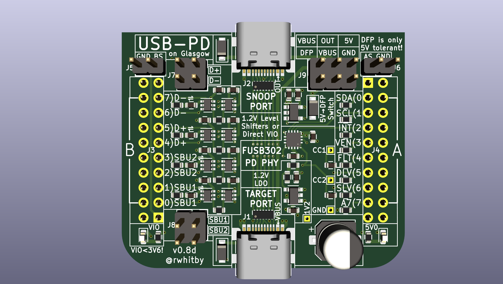
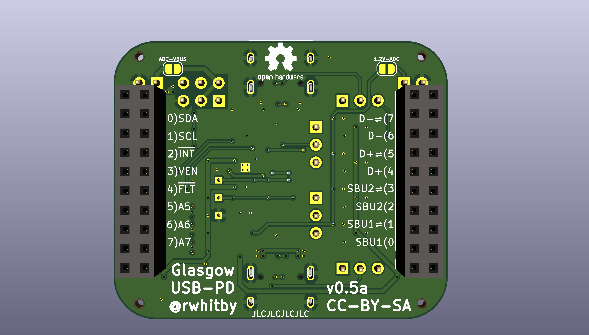

# Glasgow USB-PD Add-On

## Goals

- Enable Glasgow applet control of a USB-PD PHY to emulate the following functionalities:
  - Sink
  - Source
  - DRP
  - Active Cable (SOP'/SOP'')
  - Snooping (no pull-up/pull-down on CC1/CC2 and no GoodCRC responses)

- Control a 5V load switch to drive VBUS for Source operation
  - Will only drive 5V but should tolerate 20V as a sink
    - This will be achieved using an isolation jumper

- Be able to send VDMs to control debug interfaces on certain computers
  - Need to support SOP'Debug and SOP'Debug messages

- Enable UART and I2C functionality for D+/D- and SBU1/SBU2 (debug interfaces)
  - These must go down to 1.2V and up to 3.3V
  - The D+/D- and SBU1/SBU2 pairs may both be at 1.8V to 3.3V (same voltage for both)
  - Either or both D+/D- and SBU1/SBU2 pairs may be at 1.2V
  - Selection of 1.2V or (1.8V to 3.3V) is under software control

- Negotation of PD contract may need to be done in gateware
  - The timing may be too constrained to do this on the python host side

- Putting a Luna USB stack in the FPGA is out of scope
  - But we should make it easy to connect a Luna board externally for this

- Assembly at JLCPCB
  - Choosing Basic Parts whereever possible to save costs

- Able to measure VBUS on either the PD controller or the Glasgow ADC (or both)
  - Need a solder bridge to isolate ADC for RevC1 or earlier boards

- All spare glasgow I/O available on via test points
  - Able to blue-wire strong pull-up or pull-down for spare I/Os

- No connection to high speed lanes
  - But possibility to snoop LSTX/LSRX on SBU1/SBU2 for TBT3/USB4

- Initially support FUSB302/FUSB302B devices
  - Testing will use FUSB302B primarily
  - Footprint compatible with FUSB302(A), but different I2C address
  - Footprint compatible with FUSB302T, but different I2C address
  - Footprint compatible with FUSB302B(01,10,11), but different I2C address

- Potentially support large extended messages by streaming the FUSB302 FIFO through the FPGA

## Applet Requirements

- Applet should start Port A at 3.3V, and check if FUSB302 is
  available, before raising voltage to 5V.  This is to prevent the
  case that plugging in the addon the wrong way around blows up the
  level shifters.

## Current Status

