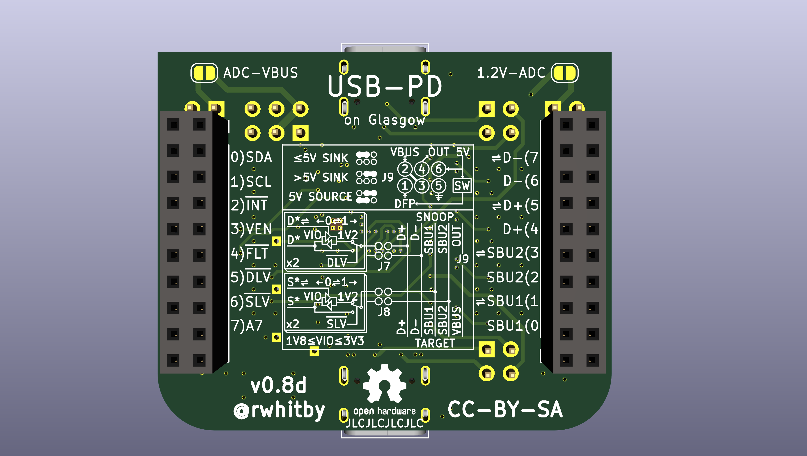

# Glasgow USB-PD Add-On

## Goals

- Enable Glasgow applet control of a USB-PD PHY to emulate the following functionalities:
  - Sink
  - Source
  - DRP
  - Active Cable (SOP'/SOP'')
  - Snooping (no pull-up/pull-down on CC1/CC2 and no GoodCRC responses)

- Control a 5V load switch to drive VBUS for Source operation
  - Will only drive 5V but should tolerate 20V as a sink

- Be able to send VDMs to control debug interfaces on certain computers
  - Need to support SOP'Debug and SOP'Debug messages

- Enable UART and I2C functionality for D+/D- and SBU1/SBU2 (debug interfaces)
  - These must go down to 1.2V and up to 3.3V
  - Each pair of D+/D- and SBU1/SBU2 may be at different voltages
  - Fine tuning of voltages by choosing more accurate resistors

- Negotation of PD contract will need to be done in gateware
  - The timing is too constrained to do this on the python host side

- Level shifter voltage selection must be a physical means
  - We don't want programming errors blowing up expensive 1.2V CPUs
  - Use jumpers, and all jumpers out must be a safe voltage

- We may want to put some kind of Luna USB stack in the FPGA in the future
  - Need a switchable pull-up on D+ to indicate a full speed device
  - Probably need switchable pull-downs on D+/D- to be a host

- Assembly at JLCPCB
  - Choosing Basic Parts whereever possible to save costs

- Able to measure VBUS both on either the PD controller or the Glasgow ADC (or both)

- All spare glasgow I/O available on test points
  - Able to blue-wire strong pull-up or pull-down for spare I/Os

- No connection to high speed lanes
  - But possibility to snoop LSTX/LSRX on SBU1/SBU2 for TBT3/USB4

- Initially support FUSB302/FUSB302B devices
  - Testing will use FUSB302B primarily
  - Footprint compatible with FUSB302(A), but different I2C address

- Potentially support large extended messages by streaming the FUSB302 FIFO through the FPGA

## Current Status

